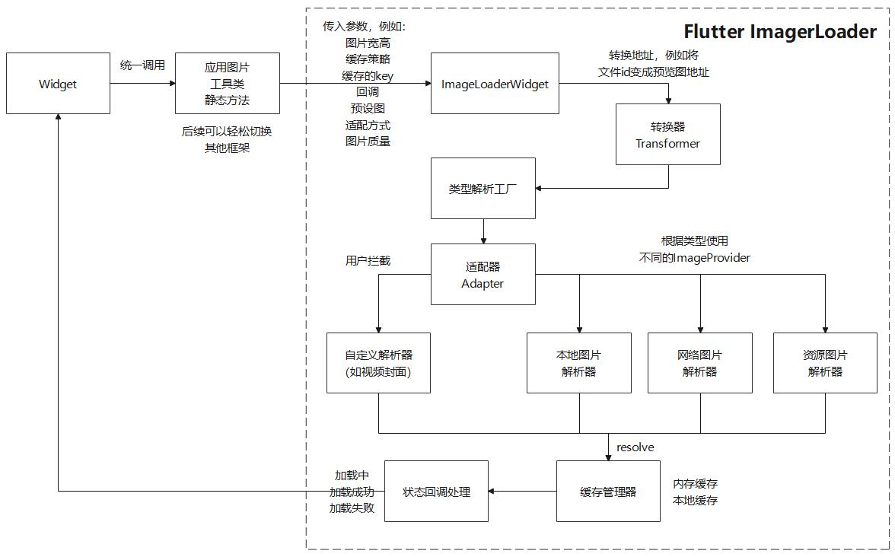

## Flutter图片加载器

全平台纯Flutter实现的图片加载器，支持Flutter3.0及空安全。


其包含的特性：
- 支持转换器，自定义路径转换
- 支持适配器，自定义加载逻辑
- 支持三级缓存，自定义CacheKey
- 统一的入口，兼容网络图/资源图/本地图

- 支持ImageProvider.loadBuffer特性(**仅Flutter3.3+**), 详情参考[Flutter官方文档](https://flutter.cn/docs/release/breaking-changes/image-provider-load-buffer)

- 支持Web图像设置header(**后续可能调整**)

  

图片引擎架构及调用建议



## 支持平台

**注：Web无法加载本地图片，由于浏览器权限问题导致**

平台 | 资源图 | 本地图 | 网络图
:---: | :---: | :---: | :---:
Windows | ✅ | ✅ | ✅
MacOS | ✅ | ✅ | ✅
Linux | ✅ | ✅ | ✅
Android | ✅ | ✅ | ✅
iOS | ✅ | ✅ | ✅
Web | ✅ | ❌ | ✅

## 功能支持
图片类型 | 本地缓存 | 内存缓存 | 视图缓存 | placeholder | error占位 | 状态监听 | 缩放图片节省内存
:---: | :---: | :---: | :---: | :---: | :---:| :---:| :---: 
资源图 | - | - | ✅ | ❌ | ✅ | ✅ | 按设备适配
本地图 | - | ❗ | ✅ | ❌ | ✅ | ✅ | ✅
网络图 | ✅ | ✅ | ✅ | ✅ | ✅ | ✅ | ✅
自定义适配器 | ✅ | ✅ | ✅ | ✅ | ✅ | ✅ | ✅

**注意：**
- **内存缓存逻辑已存在，但本地图未实现，应用可以自行创建即可**
- **视图缓存由PaintingBinding实现,若修改了ImageCache可能会失效**
- **CacheKey参数仅支持本地缓存和内存缓存**

## 使用方法

1.全局配置（可选）

**设置转换器/适配器示例，更多参数查看demo**

```dart
  // 全局配置,一般放在引擎初始化位置
  ImageLoaderConfig()
    // 自定义转换器
    ..transformer = ImageLoaderTransformer((source) {
      if (source is MusicCover) {
        return LoadableSource(source.file, "MusicCover");
      }
      return ImageLoaderTransformer.defaultApply(source);
    })
    // 自定义适配器
    ..customAdapters["MusicCover"] = SimpleImageAdapter(
        loadAsync: (source, config) async {
          return File(source.uri).readAsBytes();
        }
    )
    // 设置缓存
    ..getDefaultCacheKey = (source, config) {
      String key = source.uri;
      return md5.convert(const Utf8Encoder().convert(key)).toString();
    }
    // 开启本地缓存
    ..diskCache = ImageLoaderDiskCache("D:/")
    ..memoryCache = ImageLoaderMemoryCache()
    // 打日志
    ..logger = debugPrint;
```

2.图片加载

**部分常用参数展示，更多参数查看demo**

```dart
ImageLoaderWidget(
        MusicCover(
          "D:/1.png",
        ),
        width: 100,
        height: 100,
        placeholder: "assets/test.png",
        error: "assets/test.png",
        fit: BoxFit.fill,
        listener: ImageLoaderListener(
          onError: (o, s) {
            debugPrint("onError $o");
          },
          onLoadCompleted: () {
            debugPrint("onLoadCompleted");
          },
        ));
  }
```


## 更多用法

参考example工程
